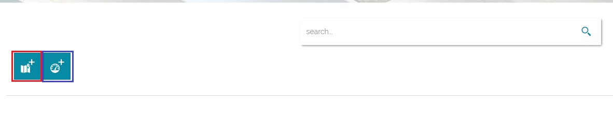
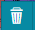

In order to get started, let us look at the portal interface and get an idea of how to navigate around it. Some functionalities are only restricted for 
*Administrators* and will be pointed out once encountered. However, you will learn more about *Administrators*, *Users* and *Groups* [here](). 

Once logged in as *Administrator*, the *Welcome Home Page* shows up as in the figure below and you will be able to view and make use of all the functionalities. 

 

# Menu bar

On the top of the page, you can find the *Main Menubar* showing the following menus :
* Connections to [GeoSolutions](https://www.geo-solutions.it/), Featured and Contents sections  (will be treated later). 
* Language Switcher 

* Your own account manager

* Accounts manager 

---
**NOTE:**
The *Accounts manager* is reserved to the *Administrator* where he can manage *Users* and *Groups*.

---

# Search bar

Under the menu bar, you can use the *Search bar* to search stored maps and dashboards in [MapStore](https://mapstore2.geo-solutions.it/mapstore/#/).

# New Map and Dashboard

Under the search bar you can find two icon buttons to create a New Map or a New Dashboard. 

# Featured

In this container the favorites maps and dashboards are stored and marked by a green star. 

---
**NOTE:**
Only *Administrators* can add maps and dashboards to *Featured* by clicking on the star icon button. 

---

# Contents

In this container new created maps will be saved under the *Maps* container and new created dashboards will be saved under the *Dashboards* container.

Depending on the permissions, the user can view and use the configuration icon buttons for each map or dashboard. 

*  allows you to delete the map or the dashboard.
*  allows you to edit the properties of the map or the dashboard such as the thumbnail, name, details and permissions. 
*  allows you to show the map or dashboard details.
*  allows you to add the map or dashboard to *Featured*. 
