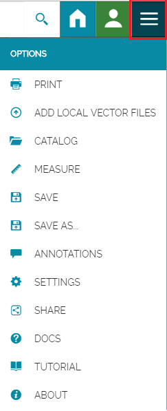

#Menu Bar
*********

In this section you will learn how to use the *Menu Bar*. As mentioned before, it includes connections to the *Home Page* and the *Account*, and:  

Search Bar
----------
The *Search Bar* of the portal allows you to find point of interests (POIs), streets or locations by name or by coordinates.  
 

* In the *Search Bar*, for example, **Type** the text "rome" then **Select** the first record. The map will automatically re-center on that area delimiting it by a polygon in the case of an area, by a line in the case of a linear shape (e.g. streets, streams) and by a marker in the case of a point.    

  

Option Menu
-----------
The *Option Menu* is the core of the *Menu Bar* and will be treated in details. It contains several options to add data from different sources to the map, perform measurments, and to save, print and share the created map. 

 
 

Click on the following links to learn more about the main options:

* [ADD LOCAL VECTOR FILES](local-files): allows to import from your machine vector files to be added to  the map;
* [CATALOG](catalog): allows you to import data from several remote services;
* [MEASURE](measure): tools to perform measurments on the map;
* [ANNOTATIONS](annotations): allows you to create customized annotations and add them to the map;
* [PRINT](print): allows you to print a created map;
* [SHARE](share): allows you to share your map.    