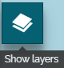
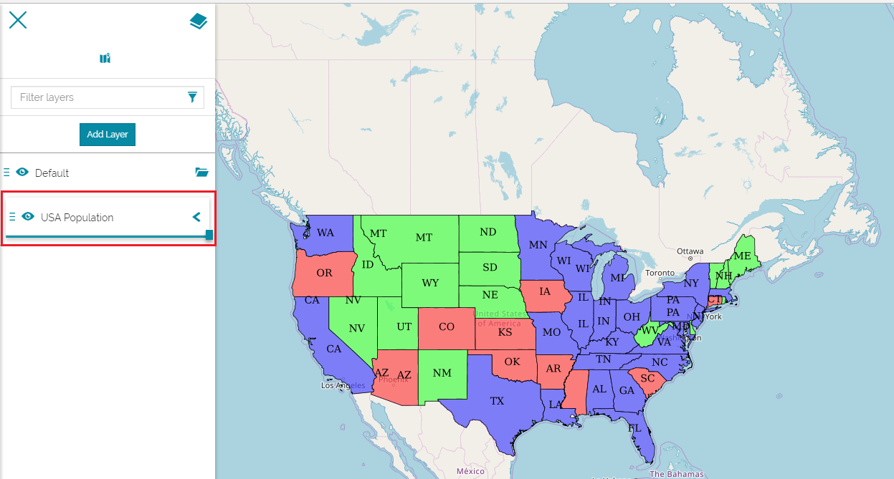

#Table of Contents (TOC)
************************
The Table of Contents, briefly TOC from now on, is a place where all layers on the map are kept. It shows what the features in each layer represent, allows you to manage the order and to set the visibility  of the added layers. Moreover, it contains several tools in order to edit and make analysis on the layers. 

Adding Layers
-------------
* **Click** on the *Show Layers* icon  situated on the top left corner of the map viewer. The TOC will open. 

  
 

* **Click** on the *Add Layer* icon . The *Catalog* page will open on the right. You will learn more about the *Catalog Services* in the [Menu Bar](menu-bar.md) section. 

   

* From the search bar highlighted in the figure above. **Search** for *USA POPULATION* layer then **Click** on  . The layer will be added to the TOC and displayed on the map.  
 
   
 